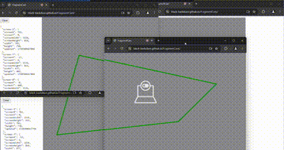

# FragmentCam
FragmentCam is a simple web application that creates a recursive webcam display using multiple windows on a single page. Each window shows a portion of the webcam feed, and moving the windows creates a fragmented, yet continuous visual effect.

## Demo
You can see a live demo of FragmentCam [here](https://black-backdoor.github.io/FragmentCam/).

## Usage
- Grant permission to access your webcam when prompted.
- Drag the windows around to observe the fragmented webcam view.

